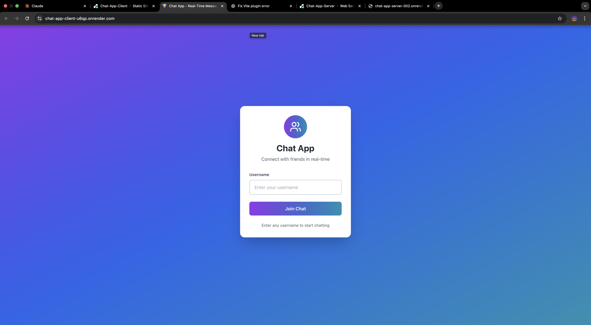
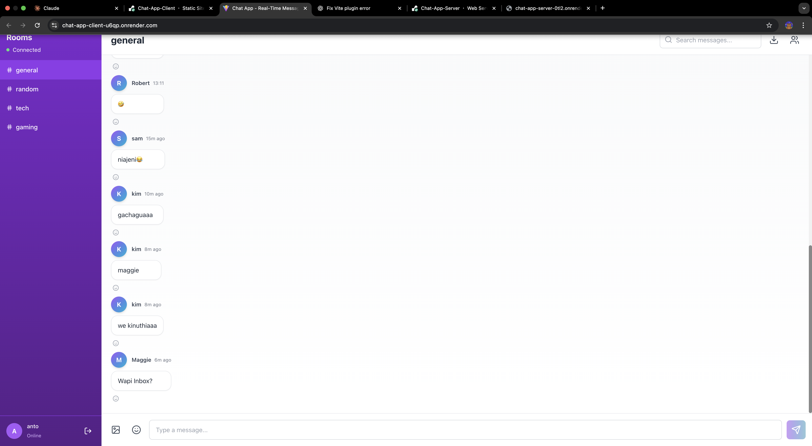
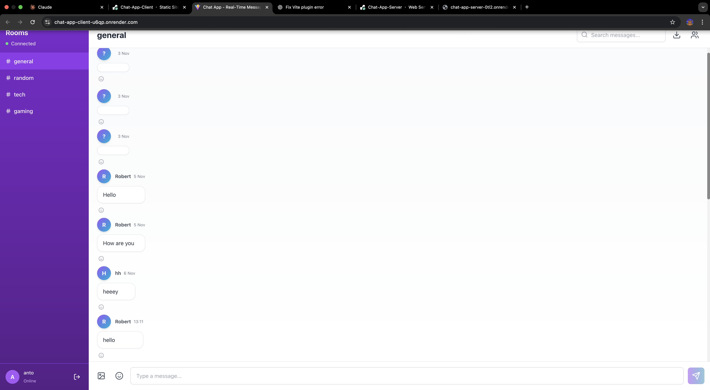
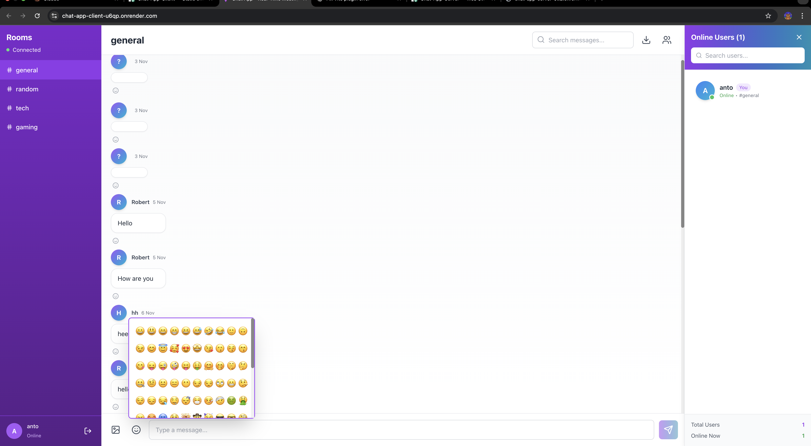

# 💬 Real-Time Chat Application

A full-stack real-time chat application built with React, Node.js, Express, and Socket.io.

## 🌐 Live Demo

- **Frontend**: https://chat-app-client-u6qp.onrender.com/
- **Backend**: https://chat-app-server-0tl2.onrender.com

## ✨ Features Implemented

### Core Features
- ✅ Real-time bidirectional communication using Socket.io
- ✅ User authentication (username-based)
- ✅ Global chat room for all connected users
- ✅ Message display with sender name and timestamp
- ✅ Online/offline user status indicators
- ✅ Typing indicators

### Advanced Features
- ✅ Private messaging between users
- ✅ Multiple chat rooms/channels
- ✅ File/image sharing capability
- ✅ Message reactions (like, love, etc.)
- ✅ Read receipts for messages

### Real-Time Notifications
- ✅ New message notifications
- ✅ User join/leave notifications
- ✅ Unread message counter
- ✅ Sound notifications for new messages
- ✅ Browser push notifications

### Performance & UX
- ✅ Message pagination for older messages
- ✅ Automatic reconnection handling
- ✅ Socket.io rooms and namespaces optimization
- ✅ Message delivery acknowledgment
- ✅ Responsive design (mobile & desktop)
- ✅ Message search functionality

## 🛠️ Tech Stack

### Frontend
- React 18
- Socket.io-client
- Vite
- [Add other libraries you used]

### Backend
- Node.js
- Express
- Socket.io
- [Add other libraries: mongoose, JWT, etc.]

## 📦 Installation & Setup

### Prerequisites
- Node.js (v18 or higher)
- npm or yarn

### Server Setup
```bash
cd server
npm install
npm run dev
```

### Client Setup
```bash
cd client
npm install
npm run dev
```

## 🔐 Environment Variables

### Server (.env)
```
PORT=5000
CLIENT_URL=http://localhost:5173
NODE_ENV=development
```

### Client (.env)
```
VITE_SOCKET_URL=http://localhost:5000
```

## 📸 Screenshots

### Login Page


### Main Chat Interface


### Online User


### Mobile View


### Typing Indicator


## 🏗️ Project Structure
```
├── client/
│   ├── src/
│   │   ├── components/
│   │   ├── pages/
│   │   ├── services/
│   │   └── socket.js
│   └── package.json
├── server/
│   ├── controllers/
│   ├── routes/
│   ├── socket/
│   └── server.js
└── README.md
```

## 🚀 Deployment

- **Frontend**: https://chat-app-client-u6qp.onrender.com/
- **Backend**: https://chat-app-server-0tl2.onrender.com/

## 👨‍💻 Development Notes

[Add any challenges you faced and how you solved them]

## 📝 License

MIT


[tony]
- GitHub: [@kim254ke](https://github.com/kim254ke/real-time-communication-with-socket-io-kim254ke.git)

# Features Documentation

## 1. Real-Time Messaging
- Instant message delivery using Socket.io
- Automatic reconnection on network issues
- Message persistence
